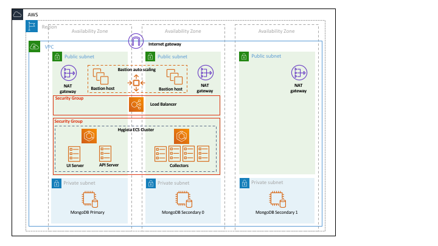

# Hygieia Quick Start

This guide helps you get [Hygieia](https://hygieia.github.io/Hygieia/getting_started.html) up and running quickly. The default configuration is deployed to AWS and capable of supporting up to 100 team dashboards out of the box. Support for additional cloud providers may be added in the future.

Before you start you will need the following a computer with a [Git client](https://git-scm.com/downloads) installed. In addition:

For AWS:
1. An [AWS Account](https://aws.amazon.com/account/) with permissions to create IAM roles and run CloudFormation
1. An [AWS Command Line Interface (CLI)](https://aws.amazon.com/cli/) installed and connected to your AWS account
1. An [AWS S3 bucket](https://aws.amazon.com/s3/) in your account for storing the CloudFormation code


### Step 1: Install MongoDB

The first thing you need with Hygieia is a MongoDB database to store the data displayed in the dashboards. We recommend following the [AWS MongoDB Quick Start](https://aws.amazon.com/quickstart/architecture/mongodb/) to setup your database. This secure implementation takes about 15 minutes to setup via CloudFormation and can run inside an existing VPC or one it creates. Once done, your environment will look like this.


### Step 2: Install Hygieia

1. Clone this repo locally and change to the project root directory ```cd hygieia-quickstart```.
1. Create a new file named deploy.properties by copying the existing [example.properties](example.properties). ```cp example.properties deploy.properties```. Modify this file to provide your environment-specific Hygieia settings. 
1. Modify the [bin/config](bin/config) file to provide your environment-specific package and deploy settings.
1. From the root directory, run ```$ bin/package```. This merges your deploy.properties settings and generates CloudFormation files that are uploaded to S3.
1. From the root directory, run ```$ bin/deploy```. This runs CloudFormation that launches Hygieia in AWS.

The deploy command creates a new CloudFormation stack named ```Hygieia-Quickstart``` by default. When done your environment will look like this.



At this point the Hygieia UI server, API server and a set of collectors should be deployed and running. All of them should be connected to the database created in step 1.


### Step 3: Configure Hygieia

In order to start collecting data within your environment, collectors need to have connection information to source systems such as Jenkins, Jira, Sonar or GitHub.

1. Follow the [Hygieia instructions to create an Admin user](https://hygieia.github.io/Hygieia/signup.html).
1. Open a browser and login to the Hygieia UI Server as the Admin server at ```http://```
1. You can configure the collectors via UI Server (cog icon in top right) **OR** you can configure them in [deploy.properties](deploy.properties). Note: In order to configure a collector, the ```CreateXXXXCollector``` property in [deploy.properties](deploy.properties) must be set to true.
1. Follow the [Hygieia instructions to create a Team Dashboard](https://hygieia.github.io/Hygieia/create_team_dashboard.html).

At this point you should have your first Team Dashboard up and running!
